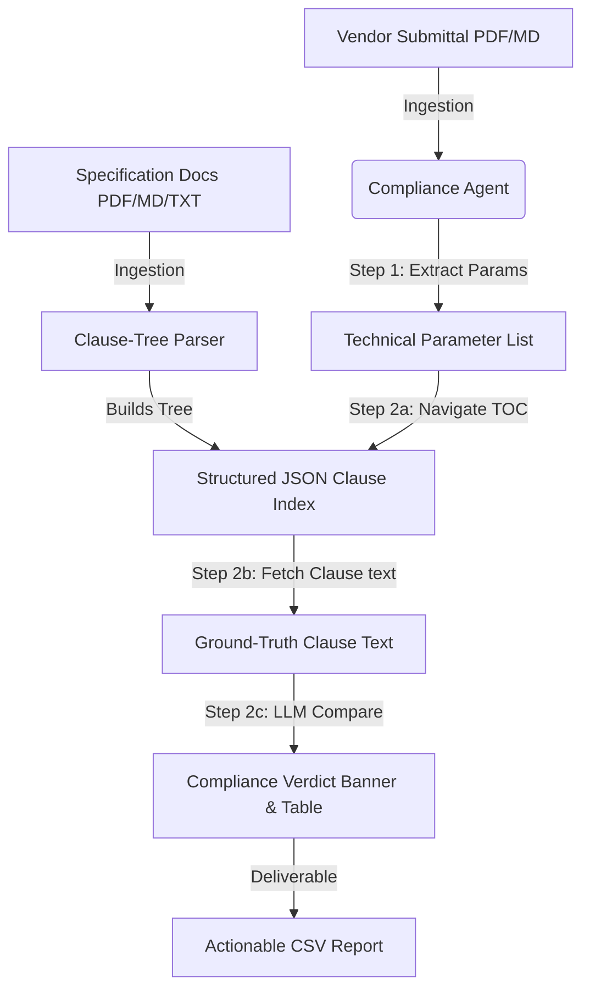

# AegisEPC — Project Intelligence & Compliance Platform
## Detailed Structured Engineering & Technical Documentation

---

## 1. System Overview & Core Concept
AegisEPC is an enterprise-grade AI-powered project intelligence layer designed to mitigate procurement misalignment and quality compliance bottlenecks in Engineering, Procurement, and Construction (EPC) projects (such as hyperscale data centre builds).

At its core, AegisEPC automates:
1. **Technical RFI Resolution:** Natural language querying of complex specification documents (standards, codes, requirements) with deterministic clause citations.
2. **Quality Compliance Audits:** Automated extraction of technical parameters from vendor submittals, matched against specification requirements, and verified for non-conformance.



---

## 2. Platform Architecture & Agent Workflows

AegisEPC replaces traditional Vector DB-based RAG engines with **Clause-Tree Retrieval**, which eliminates chunk truncation errors and guarantees 100% citation traceability.

### 2.1 Agent 1: RFI & Knowledge Copilot
- **Purpose:** Answers complex engineering questions using only loaded specification clauses.
- **Workflow:**
  1. User enters a query (e.g., *"What is the required steel grade for columns?"*).
  2. The agent compiles the Table of Contents (TOC) for the active document scope.
  3. The agent prompts the LLM to identify the relevant clause number (e.g. `Clause 3.1`).
  4. The backend retrieves the exact text of `Clause 3.1` (no search, direct lookup).
  5. The LLM synthesizes the answer, citing the source exactly: `[Source: sample_specification.md, Clause 3.1]`.
- **Per-Document Memory:** Maintains independent conversation histories and UI message states for each document scope.

### 2.2 Agent 2: Quality Compliance Agent
- **Purpose:** Checks vendor data sheets and submittals against ground-truth specifications.
- **Workflow:**
  - **Step 1: Parameter Extraction:** The LLM parses the submittal document to extract technical variables as a structured JSON array containing `parameter_name`, `value`, and `unit`.
  - **Step 2: Navigation & Verification Loop:** For each parameter:
    1. The agent queries the TOC to identify the target specification clause.
    2. The ground-truth clause text is fetched from the index.
    3. The LLM compares the submitted value to the requirement and determines the status (`COMPLIANT` or `DEVIATION`), severity (`Critical`, `Major`, `Minor`, or `None`), confidence score (`0-100`), and justification.
  - **Step 3: Output Generation:** Renders a verdict banner (compliant vs critical non-conformance), checked metrics cards, and a detailed audit trail table.

---

## 3. Algorithmic Detail: Clause-Tree vs Vector RAG

| Feature | Traditional Vector RAG | AegisEPC Clause-Tree RAG |
| :--- | :--- | :--- |
| **Ingestion Method** | Splits text arbitrarily every 500 tokens | Parses document headers into structured nodes |
| **Context Retention** | Breaks lists/clauses across chunk limits | Retains full clause text and section hierarchy |
| **Search Mechanism** | Vector cosine similarity | Deterministic TOC navigation + exact dictionary lookup |
| **Hallucination Risk** | High (retrieves irrelevant semantic text) | Zero (retrieves exact specified clause text) |
| **Traceability** | Low (returns approximate file names) | 100% (cites exact file name and clause ID) |

---

## 4. Ingestion & Document Parsing

The system implements a robust parser in `backend/doc_parser.py`:
- **Markdown (`.md`) and Text (`.txt`)**: Parses headings starting with `#`, `##`, and `###` to assign clause codes and sections. Direct text and bullet points underneath a heading are grouped into a single clause body.
- **PDF Documents (`.pdf`)**: Integrates `pdfplumber` to extract raw text, preserving line breaks, and feeds it directly into the clause-tree layout engine.

---

## 5. API Documentation

### 5.1 POST `/api/ask`
Queries the RFI Intelligence Agent.
- **Request Body:**
  ```json
  {
    "question": "string",
    "history": [{"role": "user", "content": "string"}],
    "scope": "all"
  }
  ```
- **Response:**
  ```json
  {
    "answer": "string",
    "sources": [
      {
        "file": "string",
        "clause": "string",
        "section": "string",
        "snippet": "string"
      }
    ]
  }
  ```

### 5.2 POST `/api/audit`
Runs a compliance audit on an uploaded submittal.
- **Request Body:**
  ```json
  {
    "submittal_filename": "submittal_vendorA_ups.md"
  }
  ```
- **Response:**
  ```json
  [
    {
      "parameter": "Battery Autonomy",
      "submitted": "8 minutes",
      "required": "Min 10 minutes",
      "status": "DEVIATION",
      "severity": "Critical",
      "confidence": 100,
      "clause": "Clause 4.1",
      "explanation": "Vendor submitted 8 minutes which violates the 10-minute spec."
    }
  ]
  ```

### 5.3 POST `/api/upload/spec`
Uploads and indexes a new ground-truth specification. Removes older files in `data/specs/` to maintain a single ground-truth.
- **Request Form-Data:** `file: UploadFile`

---

## 6. Installation & Deployment Guide

### Prerequisites
- Python 3.9+
- A Google Gemini API Key

### Local Installation
1. Clone the repository:
   ```bash
   git clone https://github.com/Jaswanth258/AI-Data-Centre-EPC-Platform.git
   cd AI-Data-Centre-EPC-Platform
   ```
2. Create and activate a virtual environment:
   ```bash
   python -m venv .venv
   .venv\Scripts\activate
   ```
3. Install dependencies:
   ```bash
   pip install -r backend/requirements.txt
   ```
4. Set your API Key:
   ```bash
   $env:GEMINI_API_KEY="your-api-key-here"
   ```
5. Start the FastAPI server:
   ```bash
   python -m uvicorn backend.main:app --host 127.0.0.1 --port 8001
   ```
6. Open your browser and navigate to `http://127.0.0.1:8001` to use the platform.
